# Project 5 - CEG3120 - Jerico Corneja

## Continuous Delivery Project Overview

### Goal

Automate the deployment of a containerized web application so that pushing a new Docker image triggers an automatic container refresh on the EC2 instance.

### Tools and Roles

| Tool | Role |
|------|------|
| **AWS CloudFormation** | Provisions EC2 instance and security group |
| **EC2 Instance** | Hosts Docker container and webhook listener |
| **Ubuntu EC2** | Hosts the Docker container and webhook listener |
| **Docker** | Runs containerized web application |
| **DockerHub** | Stores images and sends webhook payloads |
| **adnanh/webhook** | Listens for HTTP POST requests and triggers scripts |
| **systemd** | Manages webhook listener as a service |
| **Bash** | Scripting language for deploy.sh |
| **GitHub** | Hosts project repository and deployment files |
| **journalctl** | Allows viewing of logs |

### Diagram

```mermaid
flowchart LR
    subgraph GH["GitHub"]
        A[Push to main]
        B[Actions Workflow]
    end

    subgraph Actions["GitHub Actions"]
        C[Checkout]
        D[Build Image]
        E[Push to Registry]
    end

    subgraph DH["DockerHub"]
        F[Image Repository]
        G[Webhook Trigger]
    end

    subgraph EC2["EC2 Instance"]
        H[webhook listener\nport 9000]
        I[deploy.sh]
        J[Docker Container\nport 80]
    end

    A -->|triggers| B
    B -->|runs| C
    C --> D
    D --> E
    E -->|push image| F
    F -->|triggers| G
    G -->|POST payload| H
    H -->|validates & executes| I
    I -->|stop, pull, run| J
```



### Missing Functionality

- **Payload origin not verified**: The webhook validates payload *content* (repo name, tag) but not *origin*. DockerHub does not sign payloads like GitHub does, so anyone who knows the endpoint URL and payload structure could theoretically trigger a deployment.

---

## Part 1 - Script & Refresh

### EC2 Instance Details

#### AMI Information

| Property | Value |
|----------|-------|
| AMI ID | `ami-0f9de6e2d2f067fca` |
| OS | Ubuntu Server 24.04 LTS |
| Architecture | x86_64 (HVM) |
| Region | us-east-1 |
| Default Username | `ubuntu` |

#### Instance Type

| Property | Value |
|----------|-------|
| Instance Type | `t2.medium` |
| vCPUs | 2 |
| Memory | 4 GB RAM |

The `t2.medium` instance type provides sufficient CPU and memory resources for running Docker containers and the webhook listener service.

#### Recommended Volume Size

| Property | Value |
|----------|-------|
| Volume Size | 30 GB |
| Volume Type | gp3 |
| Delete on Termination | true |

Per the Project 5 instructions recommendations, 30 GB provides adequate storage for the Ubuntu OS, Docker images, container layers, and application logs.

#### Security Group Configuration

| Rule | Protocol | Port | Source | Purpose |
|------|----------|------|--------|---------|
| SSH | TCP | 22 | `74.129.134.252/32` | SSH access from home IP |
| SSH | TCP | 22 | `130.108.0.0/16` | SSH access from WSU campus |
| HTTP | TCP | 80 | `0.0.0.0/0` | Web application access |
| Webhook | TCP | 9000 | `0.0.0.0/0` | Webhook listener for CD pipeline |

#### Security Group Justification

- **SSH (Port 22)**: Restricted to my home IP and WSU campus CIDR range. This prevents unauthorized SSH access from the public internet while allowing me to connect from trusted locations.

- **HTTP (Port 80)**: Open to everyone (`0.0.0.0/0`) because the web application running in the Docker container needs to be publicly accessible for testing and demonstration.

- **Webhook (Port 9000)**: Open to everyone because GitHub/DockerHub needs to send HTTP POST requests to trigger the container refresh script. The `adnanh/webhook` service listens on this port by default.

#### User Data

- **Docker Installation**: Installs Docker
- **Set Hostname**: Sets hostname to `CORNEJA-P5-Ubuntu`

### Docker Setup

Docker installation is handled by the UserData script in `CORNEJA-ec2-cf-yml`

```bash
curl -fsSL https://get.docker.com -o get-docker.sh && \
          sh get-docker.sh && \
          usermod -aG docker ubuntu && \
          systemctl enable docker && \
          systemctl start docker && \
```

Confirm Docker installation and hostname changes were successful with:
(I would run them separately as is more than a couple of lines of output)

```bash
sudo systemctl status docker --no-pager && \
docker --version && \
hostname && \
sudo tail -30 /var/log/cloud-init-output.log
```

### Pulling and Running Containers

```bash
# To pull a container image from DockerHub repo
docker pull {username}/{imageName}:{version}

# To create and run a new container from an image
docker run {imageName}

# To create and run a new container from an image in the background
docker run -d \                               # -d flag runs in the background
    --name "${CONTAINER_NAME}" \              # Name the container 
    --restart unless-stopped \                # Set restart policy
    -p "${HOST_PORT}:${CONTAINER_PORT}" \     # Port map host port to container port
    "${IMAGE}"                                # The image to run
```

### Deploy Script

**Script:** [deployment/deploy.sh](https://github.com/WSU-kduncan/ceg3120f25-jericoco520/blob/main/Projects/Project5/deployment/deploy.sh)

#### Description

The `deploy.sh` script automates the container refresh process for the CD pipeline. It performs the following steps in order:

| Step | Action | Description |
|------|--------|-------------|
| 1 | Stop Container | Stops the running container if it exists |
| 2 | Remove Container | Removes the old container to free the name |
| 3 | Pull Image | Pulls the `latest` tagged image from DockerHub |
| 4 | Run Container | Starts a new container with `-d` (detached) and `--restart unless-stopped` flags |

I added to the script configurable variables at the top for easy customization: (I keep forgetting Host and Container ports...)

- `DOCKERHUB_USER` - DockerHub username
- `IMAGE_NAME` - Name of the image
- `CONTAINER_NAME` - Name for the running container
- `HOST_PORT` / `CONTAINER_PORT` - Port mapping

#### Testing & Verification

To test the script works correctly:

1. **Run the script:**
   ```bash
   ./deploy.sh
   ```

2. **Verify container is running:**
   ```bash
   docker ps
   ```
   Expected: Container `p4-coffee-website` should be listed with status "Up ..."

3. **Verify the web application is accessible:**
   ```bash
   curl http://localhost:80
   ```
   You can also visit `http://localhost:80` or `http://<EC2_PUBLIC_IP>` in a browser

4. **Check container logs:**
   ```bash
   docker logs p4-coffee-website
   ```

### Resources

- [AWS CloudFormation EC2 Configuration](https://docs.aws.amazon.com/AWSCloudFormation/latest/UserGuide/quickref-ec2-instance-config.html#scenario-ec2-bdm) - Used heavily for configuring EC2 Instance in a Cloudformation template
- [Sample EC2 CF Template](https://github.com/aws-cloudformation/aws-cloudformation-templates/blob/main/EC2/EC2InstanceWithSecurityGroupSample.yaml) - This was a great starting point provided by the AWS CloudFormation Team repo
- [My Project 2 Cloud Formation Template](https://github.com/WSU-kduncan/ceg3120f25-jericoco520/blob/main/Projects/Project2/Corneja-CF.yml) - Borrowed from my previous UserData scripts and general sanity checks when configuring new EC2 cf template
- Based on what I setup in `CORNEJA-ec2-cf.yml` I asked Claude to format tables for the EC2 overview (I like the tables for clarity but they are time consuming to hand make :/)
- [How to Evaluate Exit Codes In Bash](https://linuxsimply.com/bash-scripting-tutorial/process-and-signal-handling/exit-codes/check-exit-code/)
- [Best Practice Deploying EC2 Instances with CloudFormation](https://aws.amazon.com/blogs/infrastructure-and-automation/best-practices-for-deploying-ec2-instances-with-aws-cloudformation/)

---

## Part 2 - Listen

### Installing Webhook

```bash
sudo apt-get install webhook
```

Install adnanh's webhook to the EC2 instance using the command above

### Verify Webhook Installation

```bash
# Verify installation by running webhook
sudo systemctl enable webhook
sudo systemctl start webhook
sudo systemctl status webhook

# Expected output
● webhook.service - Webhook CD Pipeline Listener
     Loaded: loaded (/etc/systemd/system/webhook.service; enabled; vendor preset: enabled)
     Active: active (running) since Thu 2025-12-11 00:27:59 UTC; 1h 51min ago
     .
     .
     . rest of output
```

### Summary of Webhook Definition file

The `hooks.yml` file defines a webhook endpoint that listens for DockerHub push events and triggers container redeployment.

| Property | Value | Purpose |
|----------|-------|---------|
| `id` | `deploy-coffee-website` | The webhook endpoint |
| `execute-command` | `/home/ubuntu/deploy.sh` | Script to run when triggered |
| `command-working-directory` | `/home/ubuntu` | Working directory for script execution |
| `response-message` | `Deployment triggered successfully` | HTTP response sent back to caller |

**Trigger Rules (AND condition):**
- Validates `repository.repo_name` equals `jericoco520/p4-coffee-website`
- Validates `push_data.tag` equals `latest`

Both conditions must match for the webhook to execute the deploy script, so that only pushes to the correct repository with the `latest` tag trigger a redeployment.

### Creating a Webhook Configuration File

You may create the configuration file using `JSON` or `YML`

```json
// Sample JSON webhook configuration file
[
  {
    "id": "redeploy-webhook",
    "execute-command": "/var/scripts/redeploy.sh",
    "command-working-directory": "/var/webhook"
  }
]
```

```yml
# Sample of YML webhook configuration file
- id: redeploy-webhook
  execute-command: "/var/scripts/redeploy.sh"
  command-working-directory: "/var/webhook"
```

I chose to go with validating using the DockerHub payload in the configuration file:

```yml
# Deploy hook for project 5 coffee website
- id: "deploy-coffee-website"
  execute-command: "/home/ubuntu/deploy.sh"
  command-working-directory: "/home/ubuntu"
  response-message: "Deployment triggered successfully"
  trigger-rule:
    # Validate DockerHub payload matches the repository name
    match:
      type: "value"
      value: "jericoco520/p4-coffee-website"    
      parameter:
        source: "payload"
        name: "repository.repo_name"
    # Validate DockerHub payload matches the tag
    match:
      type: "value"
      parameter:
        source: "payload"
        name: "push_data.tag"
```

### Loading Definition File

Start the webhook service with the hooks definition file:

```bash
webhook -hooks /home/ubuntu/hooks.yml -verbose
```

#### Verifying Definition File Loaded

When the webhook starts successfully, the output should display:

```text
[webhook] serving hooks on http://0.0.0.0:9000/hooks/{id}
```

If the definition file loaded correctly, you should see the hook ID in the startup logs:

```text
[webhook] loaded hooks from /home/ubuntu/hooks.yml
[webhook]   > deploy-coffee-website
```

#### Verifying Webhook Receives Payloads

**Monitoring Webhook Logs:**

```bash
# To see webhook logs output onto the terminal
sudo journalctl -u webhook -f

```

When a payload triggers the hook, look for log entries like:

```text
[webhook] deploy-coffee-website got matched
[webhook] deploy-coffee-website hook triggered successfully
```

If the trigger rules don't match, you'll see:

```text
[webhook] deploy-coffee-website did not get matched
```

**Checking Docker Process Views:**

After a successful webhook trigger, verify the container was redeployed in the EC2 instance:

```bash
# List running containers and look for the container with recent start time
docker ps

# Expected output showing container was recently created
CONTAINER ID   IMAGE                            STATUS         PORTS                NAMES
abc123def456   jericoco520/p4-coffee-website    Up 5 seconds   0.0.0.0:80->80/tcp   p4-coffee-website
```

The `STATUS` column showing a recent uptime (e.g. "Up 5 seconds") confirms the container was refreshed by the deploy script.

Link to my definition file: [definition file](https://github.com/WSU-kduncan/cicdf25-jericoco520/blob/main/deployment/hooks.yml)

### Resources

- [adnanh's webhook github page](https://github.com/adnanh/webhook) - Provided overview of webhooks
- [DockerHub Webhooks](https://docs.docker.com/docker-hub/repos/manage/webhooks/) - Provided understanding of correct parameters for `match:`
- [Hook Definitions](https://github.com/adnanh/webhook/blob/master/docs/Hook-Definition.md) - Provided understanding usage of `id`, `response-message`, `command-working-directory`, `response-message`, etc
- [Hook Rules](https://github.com/adnanh/webhook/blob/master/docs/Hook-Rules.md) - Explained usage of `and:` and `match:` properties

### Configuring a Webhook Service

The systemd service file runs the webhook listener as a background service that starts on boot and auto-restarts on failure.

| Property | Value | Purpose |
|----------|-------|---------|
| `After` | `network.target docker.service` | Ensures network and Docker are available before starting |
| `User/Group` | `ubuntu` | Runs webhook as non-root user |
| `ExecStart` | `/usr/bin/webhook -hooks /home/ubuntu/hooks.yml -port 9000 -verbose` | Command to start webhook with config |
| `Restart` | `on-failure` | Auto-restart if the service crashes |
| `StandardOutput/Error` | `journal` | Logs to systemd journal for monitoring |

**Enabling and Starting the Service:**

```bash
# Copy service file to systemd directory
sudo cp webhook.service /etc/systemd/system/webhook.service

# Reload systemd to recognize the new service
sudo systemctl daemon-reload

# Enable service to start on boot
sudo systemctl enable webhook

# Start the service
sudo systemctl start webhook
```

**Verifying Service is Capturing Payloads:**

```bash
# Check service status
sudo systemctl status webhook

# Monitor logs in real-time for incoming payloads
sudo journalctl -u webhook -f
```

When a payload is received and triggers the script, the logs will show output such as:

```text
[webhook] deploy-coffee-website got matched
[webhook] executing /home/ubuntu/deploy.sh
[webhook] deploy-coffee-website hook triggered successfully
```

Link to service file: [webhook.service](https://github.com/WSU-kduncan/cicdf25-jericoco520/blob/main/deployment/webhook.service)

### Resources

- [DigitalOcean - Understanding Systemd Units and Unit Files](https://www.digitalocean.com/community/tutorials/understanding-systemd-units-and-unit-files) - Guide to creating systemd services (most useful)
- [Claude] - I found the above website very useful. I prompted Claude to summarize the most useful parts needed to enable webhook to start up as soon as the EC2 instance turned on. It answered with summary of the three required sections unit, service, and install and a visual of the boot sequence. It included dependencies, how to set the command to start, restart policy, and user permissions for docker usage.

---

## Part 3 - Send a Payload

### Configuring a Payload Sender

#### Justification

I chose to use DockerHub for a very silly reason. I was initially doing this project in another repo, not the cicd repo. Therefore I did not have Github Actions setup. My solution was to do the next best thing DockerHub payload verification. 

My implementation of the DockerHub payload verification is not the most secure. I did double check with Claude how GitHub and DockerHub webhook differs. It informed me something I noticed, that anyone who knows my endpoint could theoretically send me a payload.

Security-wise, GitHub Actions > DockerHub payload verification. Simply due to the fact that GitHub signs their payloads.

#### Enabling DockerHub to Send Payloads

1. Navigate to the DockerHub repository: `https://hub.docker.com/repository/docker/{username}/{repo}`
2. Click on **Webhooks** tab
3. Create a new webhook:
   - **Name**: Include name (e.g. `P5-CD-Pipeline`)
   - **Webhook URL**: `http://{EC2_PUBLIC_IP}:9000/hooks/deploy-coffee-website`
4. Click **Create**

The webhook URL format is: `http://{host}:{port}/hooks/{hook-id}` where `{hook-id}` matches the `id` in your `hooks.yml`.

#### What Triggers a Payload

DockerHub sends a webhook payload when:

| Event | Trigger |
|-------|---------|
| `docker push` | Any push to the repository triggers a payload |
| Automated Build | When DockerHub completes an automated build |

Each push to the DockerHub repository (e.g. `docker push jericoco520/p4-coffee-website:latest`) will send a POST request to the configured webhook URL.

#### Verifying Successful Payload Delivery

**On DockerHub:**

- Check the webhook history in the Webhooks tab by clicking the three dots to the right
- Successful deliveries have Status=success with the code=200

**On EC2 Instance:**

```bash
# Monitor webhook logs for incoming payloads when testing
sudo journalctl -u webhook -f
```

Successful delivery and trigger shows:

```text
[webhook] incoming HTTP POST request from {IP}
[webhook] deploy-coffee-website got matched
[webhook] executing /home/ubuntu/deploy.sh
[webhook] deploy-coffee-website hook triggered successfully
```

**Verify container was updated:**

```bash
docker ps
# Check STATUS column shows recent uptime (e.g., "Up 10 seconds")
```

#### Validating Webhook Triggers from Appropriate Sources

My `hooks.yml` validates payloads by checking the payload content itself:

```yaml
trigger-rule:
  and:
    - match:
        type: "value"
        value: "jericoco520/p4-coffee-website"
        parameter:
          source: "payload"
          name: "repository.repo_name"
    - match:
        type: "value"
        value: "latest"
        parameter:
          source: "payload"
          name: "push_data.tag"
```

This ensures:

- Only payloads with `repository.repo_name` = `jericoco520/p4-coffee-website` trigger the script
- Only payloads with `push_data.tag` = `latest` trigger the script

**Limitation:** This validates payload *content*, not payload *origin*. Unlike GitHub webhooks which use HMAC signatures, DockerHub doesn't sign payloads. Someone who knows the endpoint URL and payload structure could theoretically fake a request.

**For production environments**, I would consider:

- Restricting port 9000 to known DockerHub IP ranges
- Using GitHub Actions with signed webhooks instead
- Adding a secret token in the webhook URL path

### Resources

- [DockerHub Webhooks](https://docs.docker.com/docker-hub/repos/manage/webhooks/)
- [Claude] Prompt: Compare my DockerHub webhook solution to a standard GitHub webhook solution
---


