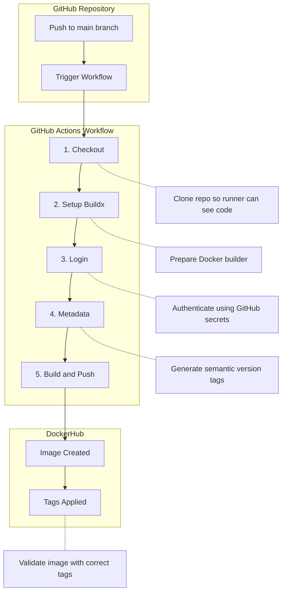

# cicdf25-jericoco520

## Continuous Integration Project Overview

### Goal

Automate the process of building, tagging, and publishing Docker container images to DockerHub whenever code is pushed to the main branch or a version tag is created. We want to eliminate manual build steps and ensures consistent, versioned deployments.

### Tools Used

| Tool | Role |
|------|------|
| **Docker** | Containerization platform for building and running images |
| **DockerHub** | Container registry for storing and distributing images |
| **GitHub Actions** | CI/CD platform that automates the build and push workflow |
| **Apache httpd** | Base web server image used to serve the website |
| **Git** | Version control and semantic version tagging |

Ref: [C6] I asked Claude to format the Tools and Roles table

### CI/CD Process Flow



Ref: [C6]

```text
Prompt: Under tools used create a mermaid diagram for this process and place it at line 6 @README-CI.md :

From a GitHub repo
1) Push to main branch -> Trigger Workflow

From Workflow
2) Checkout -> Clone the repo so the runner can see the code
3) Setup Buildx -> Prepare the Docker builder
4) Login -> Authenticate to DockerHub using GitHub secrets
5) Metadata -> Generate the semantic versioning tags
6) Build and Push -> Create the image and push to DockerHub

From DockerHub
7) Validate -> View image was created with correct tags
```

## Part 1 Dockerfile and Building Images

The website I have set up is the same coffee history/process website I used for project 3.
[This is where the web-content is on GitHub](https://github.com/WSU-kduncan/cicdf25-jericoco520/tree/main/web-content)

The [DockerFile](https://github.com/WSU-kduncan/cicdf25-jericoco520/blob/main/web-content/Dockerfile) will build from the official Apache HTTP server image. Afterwards, it will copy the contents of our newly created web-content/ directory to the container's filesystem. Specifically into the default web content directory for httpd.

### Build Command

This command will:

1) Build for the `linux/amd64` platform
2) Tag the image as p4-coffee-website:1.0
3) Push to DockerHub

*Note*: Pushing to DockerHub requires one to be authenticated

```bash
docker buildx build --platform linux/amd64 \
-t jericoco520/p4-coffee-website:1.0 \
--push .
```

### Running the Container to Serve Web App

Prequisites:

1) Image exists
2) Docker Daemon running

If you currently don't have the image, pull it from DockerHub:

```bash
docker pull jericoco/p4-coffee-website
```

The Run command will:

1) Run in detached mode
2) Port maps the host port to 80 and the container port to 80 (E.G. `HostPort:ContainerPort` or `80:80`)
3) Names the container p4-coffee-website
4) Set the auto-restart policy to auto-restart unless manually stopped
5) Runs the image p4-coffee-website

```bash
docker run -d -p 80:80 --name p4-coffee-website --restart unless-stopped jericoco520/p4-coffee-website
```

Access the web app from a browser from the URL: `http://localhost:80`

## Part 2 GitHub Actions and DockerHub

**Task 1**: Configure Github Actions access to DockerHub repositories

1) Generate personal access token (PAT) in DockerHub
2) Configure the token with:
   1) Description
   2) Access permissions -> Read & Write (allow Github Actions to build and push images)
3) Copy the token and store as Github Actions secret

**Task 2**: Configure Github Action secret

1) Go to Github -> Settings -> Secrets and... -> Actions
2) Create `New Repository Secret`
3) Add the DOCKER_USERNAME and DOCKER_TOKEN **secrets**, respectively
   1) DOCKER_USERNAME and DOCKER_TOKEN is your login & password for authenticating to DockerHub
Ref: [C5]
**Task 3**: Setup Github Actions workflow

We want to be able to build and push container images to my DockerHub repo

### Workflow Trigger

```yml
on:
  push:
    branches:
      - main
```

Ref: [C1]
The workflow only runs when someone **pushes** commits to the `main` branch.

Sections:

`on:` -> Defines when the workflow should trigger
`push:` -> The type of the trigger, so run when a **push** happens
`branches:` -> Specifies which branches can trigger this workflow

### Workflow Steps

```yml
# Rest of code above...
steps:
  - name: Checkout code
    uses: actions/checkout@v4
  
  - name: Set up Docker Buildx
    uses: docker/setup-buildx-action@v3
  
  - name: Login to Docker Hub
    uses: docker/login-action@v3
    with:
      username: ${{ secrets.DOCKER_USERNAME }}
      password: ${{ secrets.DOCKER_TOKEN }}
# Rest of code below...
```

Ref: [C1]

`steps:` -> is a list of tasks that is performed for a job
`uses:` -> for this workflow, are pre-built actions recognized by Github
`- name:` -> an ID
`with:` -> Added parameters to the selected action

#### Porting Workflows to Other Repos

Using the workflow in a different repository you'd need to consider the following

1) Copy `.github/workflows/docker-build.yml` to the new repo
2) Create `DOCKER_USERNAME` secret in new repo
3) Create `DOCKER_TOKEN` secret in new repo
4) Copy `DockerFile` to correct path in new repo
5) Update image name (Optional)

Link to [workflow](https://github.com/WSU-kduncan/cicdf25-jericoco520/tree/main/.github/workflows)

#### Testing

**Test 1:**:

- Push a commit on the main branch
- Validate the workflow triggers on Github Actions
- Validate Success
- Validate an artifact was created (docker build)
- On DockerHub, validate an image was pushed to repo
- Validate in the `Tags` section that tags were also pushed

**Test 2**: Container Runs using Image

- Pull the image (eg `docker pull jericoco520/p4-coffee-website`)
- Check the Docker image exists locally `docker images`
- Run a container using the image `p4-coffee-website`
  - `docker run -d -p 80:80 --name p4-coffee-website --restart unless-stopped jericoco520/p4-coffee-website`
- Test in the browser the web app is working with URL `http://localhost:80`

Link to my [DockerHub Repo](https://hub.docker.com/repository/docker/jericoco520/p4-coffee-website/tags)

## Part 3 Semantic Versioning

Ref: [C2], [C3], [C4]

### Generating Tags

`git tag` - See all tags in a git repo
`git tag -a v#.#.#` - Generate a tag in a git repo
Use the `-m` flag to annotate the tag (E.G. `-m "Release version"`)

### Push a Tag

`git push origin main --tags` - Push everything to main including tags

Link to my [DockerHub Repo](https://hub.docker.com/repository/docker/jericoco520/p4-coffee-website/tags)

### My Tag Set


## Resources Used

[C1] [GitHub Actions - build-push-action docs](https://github.com/marketplace/actions/build-and-push-docker-images)
Used for learnig about the main action for building images, pushing images, and using GitHub secrets

[C2] [Docker - Tags with GitHub Actions](https://docs.docker.com/build/ci/github-actions/manage-tags-labels/)
Used for learning how to trigger on tag push

[C3] [Docker Metadata](https://github.com/docker/metadata-action?tab=readme-ov-file#semver)
Used to understand how to tag Docker images with semantic versioning

[C4] [GitHub Secrets](https://docs.github.com/en/actions/how-tos/write-workflows/choose-what-workflows-do/use-secrets)
Used to understand how to set GitHub secrets in a repo

[C6] Claude AI
Many prompts were used to supplementally understand underlying topics especially in the workflow

For example:

```markdown
# This was referring to tagging in production

Prompt: So do devs have to be mindful of their pushes for mundane changes that don't fix any bugs, add any features, or break compatibility? Surely not

Claude: Correct—not every commit needs a version tag!
When to Tag (Release)
You create a version tag only when you're ready to release:
✅ Fixed a bug users care about → v0.0.3
✅ Added a new feature → v0.1.0
✅ Made breaking changes → v1.0.0
✅ Preparing a deployment → tag it
When NOT to Tag
❌ Typo fix in comments
❌ Refactoring internal code
❌ Work-in-progress changes
❌ Documentation updates
These just get pushed to main and update latest. No tag needed.
```

```markdown
# Teach Me About GitHub Actions

Prompt: How do the GitHub predefined `uses: actions/*` work and how do I use them?

Claude: 
What Are Actions?
Actions are reusable units of code that perform specific tasks. Instead of writing shell commands, you use pre-built actions maintained by GitHub, Docker, or the community.

uses: actions/checkout@v4
        │       │      │
        │       │      └── Version (git tag or branch)
        │       └── Repository name
        └── GitHub organization

Step 1: Find the action's documentation
Go to its GitHub repo or Marketplace page to see:
Required inputs
Optional inputs
Outputs
Examples

steps:
  - name: Descriptive name
    uses: owner/action-name@version
    with:
      input1: value1
      input2: value2
```
